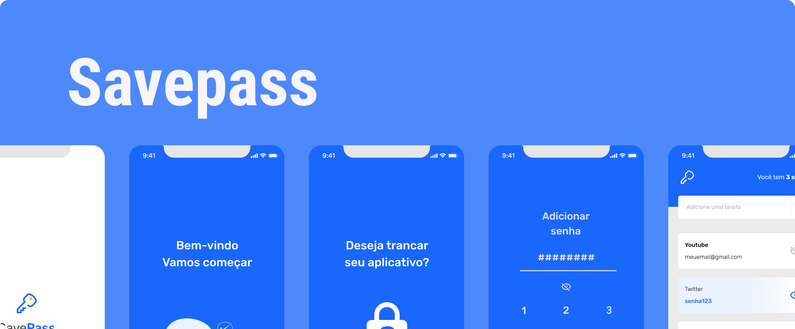
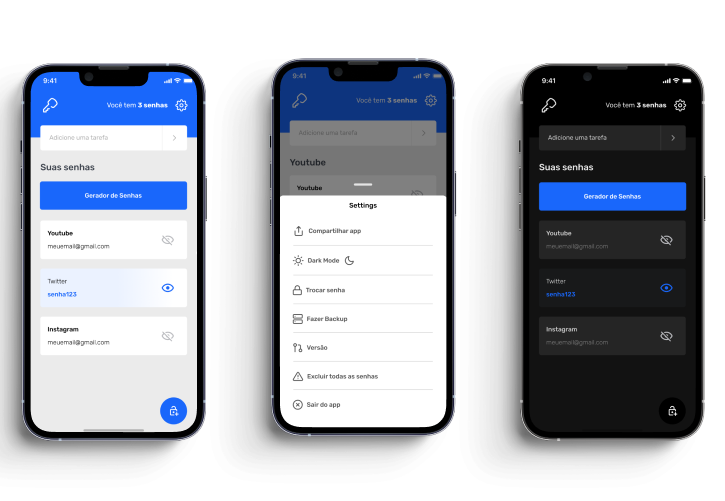

<div id="top">
  <a href="https://github.com/reciokaue/ignite-savepasse">
    
  </a>
</div>

<div align="center" style="padding-top: 25px">

  [![Contributors][contributors-shield]][contributors-url]
  [![Forks][forks-shield]][forks-url]
  [![Stargazers][stars-shield]][stars-url]
  [![Issues][issues-shield]][issues-url]
  [![MIT License][license-shield]][license-url]
  [![LinkedIn][linkedin-shield]][linkedin-url]
</div>

<br />
<div align="center">
<h3 align="center">SavePass</h3>

  <p align="center">
    <a href="https://github.com/reciokaue/ignite-savepass"><strong>Explore the docs »</strong></a>
    <br />
    <br />
    <a href="https://github.com/reciokaue/ignite-savepass">View Demo</a>
    ·
    <a href="https://github.com/reciokaue/ignite-savepass/issues">Report Bug</a>
    ·
    <a href="https://github.com/reciokaue/ignite-savepass/issues">Request Feature</a>
  </p>
</div>

<summary>Table of Contents</summary>
  <ol>
    <li>
      <a href="#about-the-project">About The Project</a>
      <ul>
        <li><a href="#figma-prototype-design">Project Design</a></li>
        <li><a href="#development">Development</a></li>
        <li><a href="#new-features">Features</a></li>
        <li><a href="#learnings">Learnings</a></li>
        <li><a href="#built-with">Built With</a></li>
      </ul>
    </li>
    <li>
      <a href="#getting-started">Getting Started</a>
      <ul>
        <li><a href="#prerequisites">Prerequisites</a></li>
        <li><a href="#installation">Installation</a></li>
        <li><a href="#usage">Usage</a></li>
      </ul>
    </li>
    <!-- <li><a href="#roadmap">Roadmap</a></li> -->
    <!-- <li><a href="#contributing">Contributing</a></li> -->
    <li><a href="#contact">Contact</a></li>
    <li><a href="#license">License</a></li>
    <!-- <li><a href="#acknowledgments">Acknowledgments</a></li> -->
</ol>

# Figma prototype design

<div align="center" >
  <a href="https://www.figma.com/file/8WbWCVM0LFHsgHRk3nmfbO/Savepass">
      
  </a>
</div>
<a href="https://www.figma.com/file/8WbWCVM0LFHsgHRk3nmfbO/Savepass">click here to go to figma project
</a>


### About The Project

# SavePass

The SavePass is an app to manage your passwords in a safe away, is easy to use focusing on the user experience with visual helps to understand what is happening in the moment.

Clean design, soft colors, and rounded shapes to be accepted for all age groups, because all need to remember your password, interesting features, dark mode to health your eyes, password generate that can generate very safe passwords for you and customizable and a password list backup (coming soon) further that you can give me constructive criticism or feature suggestions to add to app.

## Development

> The app was developed with react native and the expo framework, it makes the process 
of building the app easier and fast because I do not need to develop for two platforms (iOS and android), additionally to the expo I used the typescript to help the organization and maintenance of the code

### New Features
  * Password Detail screen 
  * Delete and exclude password
  * Welcome screens
  * Pin and Finger Print password to lock the app
  * Upgrade the design and user experience

## Learnings
  * String and array operations
  * Form validation with Yup 
  * Form management with Hook “useForm( )”, improve the performance of the forma form, decreasing the refresh rate 
  * AsyncStorage Library to save the user data and passwords  
  * Personalized Alerts and Modal Library 
  * Finger Print password validation

### Built With

* [React.js](https://reactjs.org/)
* [React Native](https://reactnative.dev)
* [Expo](https://docs.expo.dev)
* [Javascript](https://reactnative.dev)
* [Typescript](https://www.typescriptlang.org)

<p align="right">(<a href="#top">back to top</a>)</p>

<!-- GETTING STARTED -->
# Getting Started

## Prerequisites

* npm | yarn
* React Native 
* Expo

## Installation

1. Clone the repo
   ```sh
   https://github.com/reciokaue/ignite-savepass.git
   ```
2. Install NPM packages using yarn or npm

   ```js
   yarn
   ```
   ```sh
   npm install
   ```
3. Run the app
    ```sh
    expo start
    ```

<p align="right">(<a href="#top">back to top</a>)</p>


<!-- USAGE EXAMPLES -->
## Usage

O funcionamento do app é simples, caso queria ver o fluxo de funcionamento de forma visual acesse o layout <a href="https://www.figma.com/file/8WbWCVM0LFHsgHRk3nmfbO/Savepass">clique aqui</a>.

No primeiro uso o aplicativo mostra uma apresentação e de da as opções de trancar ou não seu app, selecionando a opção "sim", você sera levado para a tela de adicionar uma senha, caso escolha a opção "não", vai ser redirecionado diretamente para a tela inicial do aplicativo, após o este processo inicial caso tenha adicionado a senha ela sera requirida toda vez ao entrar no app.

O botão em cor azul, localizado na parte inferior direita do aplicativo te leva para a tela de adicionar uma nova senha, onde exitem as opções de, nome da serviço, e-mail utilizado, senha, e uma descrição cujo é opcional

Após adicionar suas senhas pode as ver na tela inicial, ao clicar no olho no lado direito dela, tera acesso a senha, caso clique no card inteiro sera levado para a tela de edição de senha

Na tela inicial você pode pesquisar uma das suas senhas adicionadas pelo nome, na caixa te texto localizada na parte superior da tela, após pressionar o botão em formato de seta aparecerão todas as senhas que contem o texto digitado 


<!-- ROADMAP -->
<!-- ## Roadmap

- [] Feature 1
- [] Feature 2
- [] Feature 3
    - [] Nested Feature

See the [open issues](https://github.com/reciokaue/ignite-savepass/issues) for a full list of proposed features (and known issues).

<p align="right">(<a href="#top">back to top</a>)</p>
 -->


<!-- CONTRIBUTING -->
<!-- ## Contributing

Contributions are what make the open source community such an amazing place to learn, inspire, and create. Any contributions you make are **greatly appreciated**.

If you have a suggestion that would make this better, please fork the repo and create a pull request. You can also simply open an issue with the tag "enhancement".
Don't forget to give the project a star! Thanks again!

1. Fork the Project
2. Create your Feature Branch (`git checkout -b feature/AmazingFeature`)
3. Commit your Changes (`git commit -m 'Add some AmazingFeature'`)
4. Push to the Branch (`git push origin feature/AmazingFeature`)
5. Open a Pull Request

<p align="right">(<a href="#top">back to top</a>)</p> -->


<!-- CONTACT -->
## Contact

Kaue Recio - [@kaue_recio](https://twitter.com/kaue_recio) - kaue.recio2@gmail.com

Project Link: [https://github.com/reciokaue/ignite-savepass](https://github.com/reciokaue/ignite-savepass)


<!-- LICENSE -->
## License

Distributed under the MIT License. See `LICENSE.txt` for more information.

<p align="right">(<a href="#top">back to top</a>)</p>

[contributors-shield]: https://img.shields.io/github/contributors/reciokaue/ignite-savepass.svg?style=for-the-badge
[contributors-url]: https://github.com/reciokaue/ignite-savepass/graphs/contributors
[forks-shield]: https://img.shields.io/github/forks/reciokaue/ignite-savepass.svg?style=for-the-badge
[forks-url]: https://github.com/reciokaue/ignite-savepass/network/members
[stars-shield]: https://img.shields.io/github/stars/reciokaue/ignite-savepass.svg?style=for-the-badge
[stars-url]: https://github.com/reciokaue/ignite-savepass/stargazers
[issues-shield]: https://img.shields.io/github/issues/reciokaue/ignite-savepass.svg?style=for-the-badge
[issues-url]: https://github.com/reciokaue/ignite-savepass/issues
[license-shield]: https://img.shields.io/github/license/reciokaue/ignite-savepass.svg?style=for-the-badge
[license-url]: https://github.com/reciokaue/ignite-savepass/blob/master/LICENSE
[linkedin-shield]: https://img.shields.io/badge/-LinkedIn-black.svg?style=for-the-badge&logo=linkedin&colorB=555
[linkedin-url]: https://www.linkedin.com/in/kaue-recio/
[product-screenshot]: images/screenshot.png
